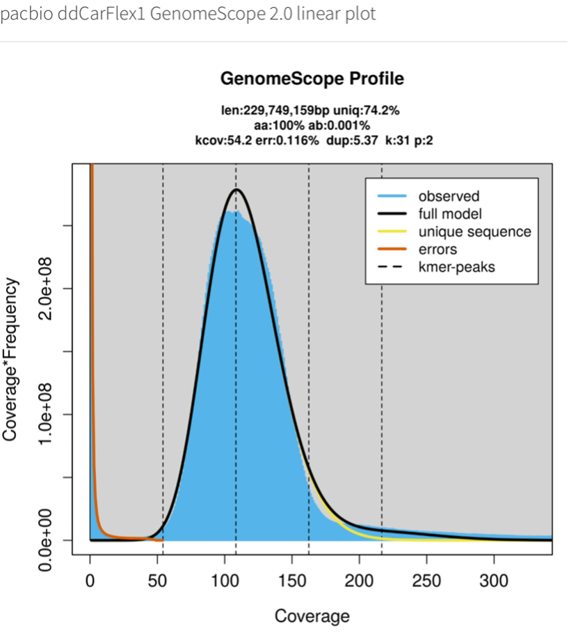
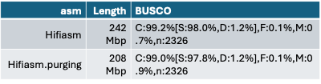
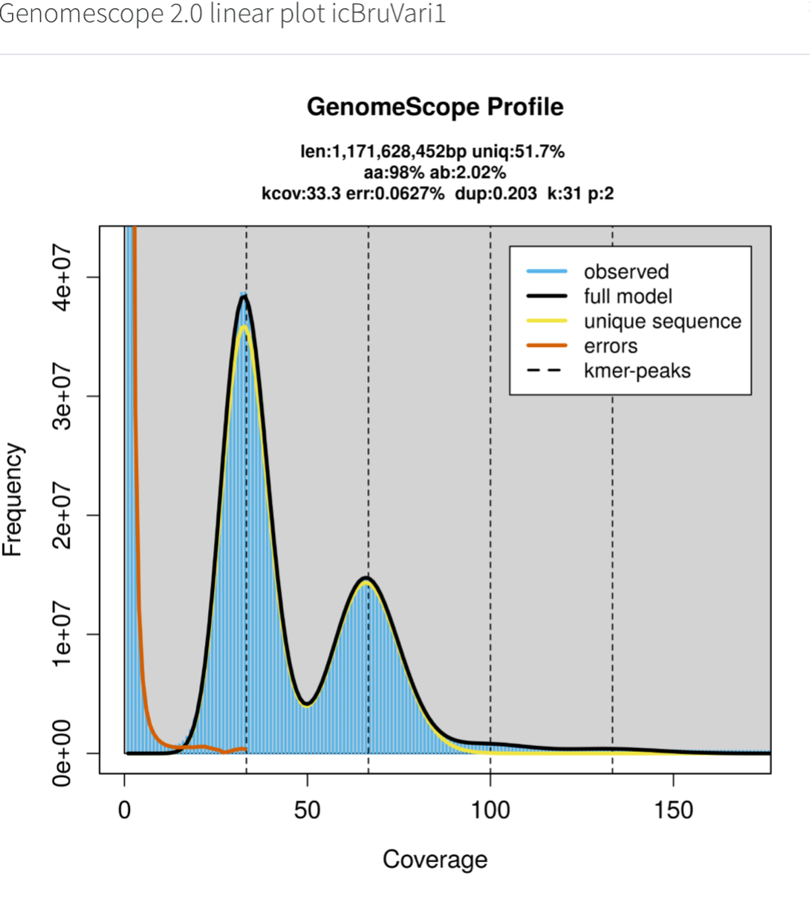
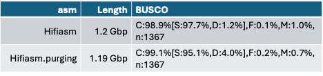
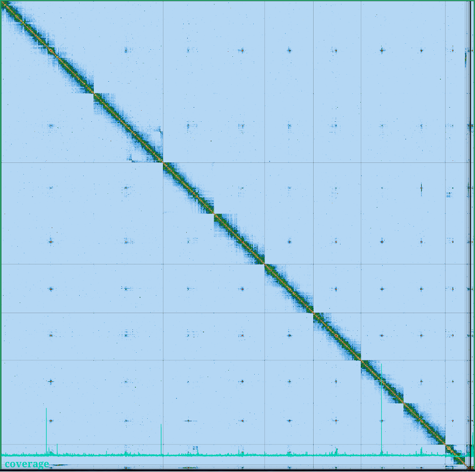
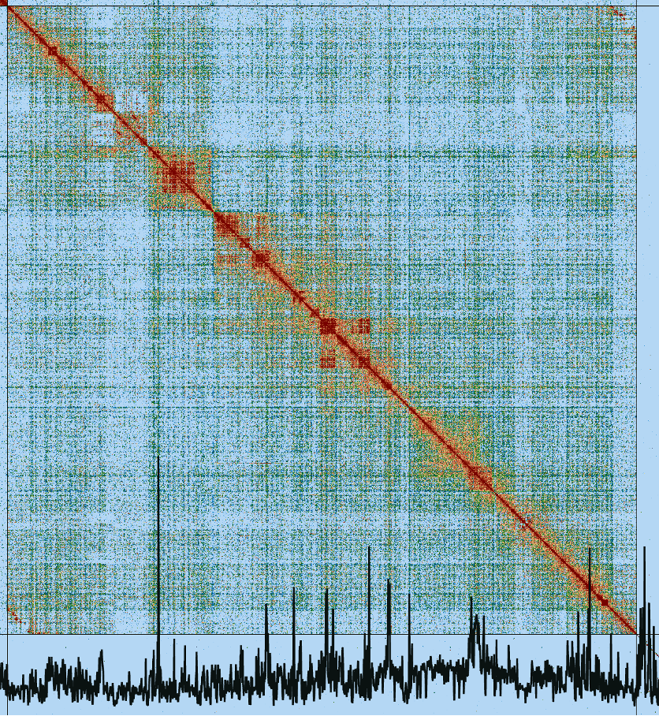

# Hands-on Manual Genome Curation Physalia course - Day 1

**Session 2.1: What to infer from assembly quality metrics?**

Please find slides for Manual Genome Curation overview and Asssembly Metrics at [slides_bga_2024.pdf](slides_bga_2024.pdf).

## 1. Have a look at the k-mer distribution and some stats of these two assemblies

What would you say about:

- Heterozygosity
- Repeats
- Did purging work?
- Describe in a few words how you would expect the HiC map to be?  Which would be the main challenges for curation?
- Would you suggest any alternatives/approaches to cope with the difficulties faced during manual curation?

**A. Dicot plant (ddCarFlex1)**

**B. Coleoptera (icBruVari1)**

## 2.	Can you spot what has been wrong with these two assemblies?

**A.**

**B.**

