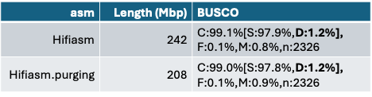
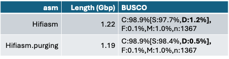

# Hands-on Manual Genome Curation Physalia course - Day 1

**Session 2.1: What to infer from assembly quality metrics?**

Please find slides for Manual Genome Curation overview and Asssembly Metrics at [Session_1_Manual_Curation_Overview.pdf](docs/Session_1_Manual_Curation_Overview.pdf) and [Session_2.1.pdf](docs/Session_2.1.pdf).

## 1. Have a look at the k-mer distribution and some stats of these two assemblies

What would you say about:

- Heterozygosity
- Repeats
- Did purging work?
- Describe in a few words how you would expect the HiC map to be?  Which would be the main challenges for curation?
- Would you suggest any alternatives/approaches to cope with the difficulties faced during manual curation?

Feel free to explore the tolqc website (https://tolqc.cog.sanger.ac.uk). Just type the tolid on the top left and have a look at some assembly stats.

**A. Dicot plant (ddCarFlex1)**

**B. Coleoptera (icBruVari1)**

## 2.	Can you spot what has been wrong with these two assemblies?

**A.**

**B.**

